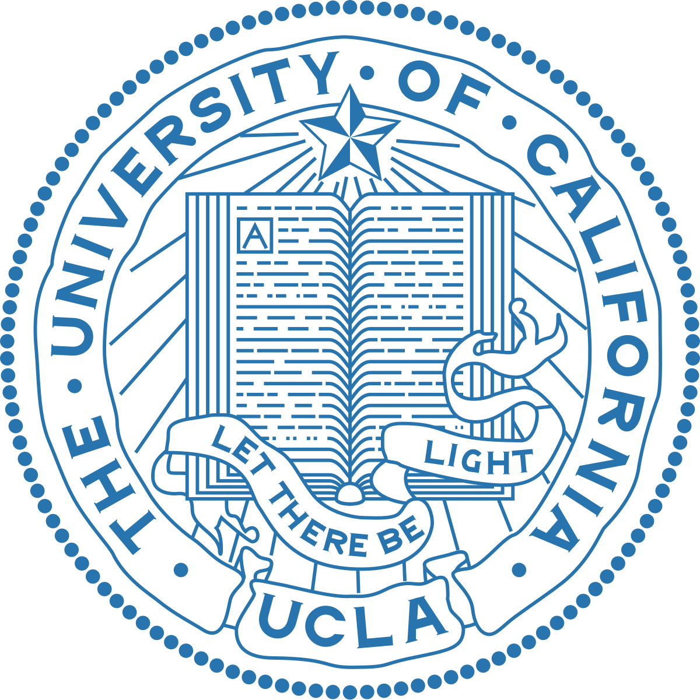

Economist, OFCE (Observatoire Français des Conjonctures Economiques)

[.png){width=20%}](https://fgeerolf.com/ofce/)
[{width=20%}](https://fgeerolf.com/cepii/)
[{width=15%}](https://fgeerolf.com/ucla/)

# Research Interests

Macroeconomics, Finance, Inflation, Housing, Pareto

# Research


Revision requested at American Economic Review

















# Travaux en Français















































# Other in English































# Débat public

## Tribunes









## Interviews







## Autres interventions (sélection)







# Teaching (English)







# Ph.D. Dissertation



# Awards

Top Finance Graduate Award 2014. [[<i class="fas fa-globe"></i> html](https://www.tilmeld.dk/financegradaward2021/previous-winners)]

Prix L.E. Rivot, Académie des Sciences, 2008.

# Curriculum Vitae

CV. [[<i class="fa-solid fa-user-tie"></i> en](https://fgeerolf.com/cv.pdf)] [[<i class="fa-solid fa-camera"></i> jpg](https://fgeerolf.com/files/fgeerolf-1.jpg)] [[<i class="fa-solid fa-camera"></i> png](https://fgeerolf.com/files/fgeerolf-1.png)]

Bibliographie. [[<i class="fa-solid fa-book"></i> en](https://fgeerolf.com/bibliography.html)] [[<i class="fa-solid fa-book"></i> fr](https://fgeerolf.com/bibliographie.html)]

# Contact

Email: francois.geerolf@polytechnique.org

OFCE  
10, place de Catalogne  
75014 PARIS  
France
